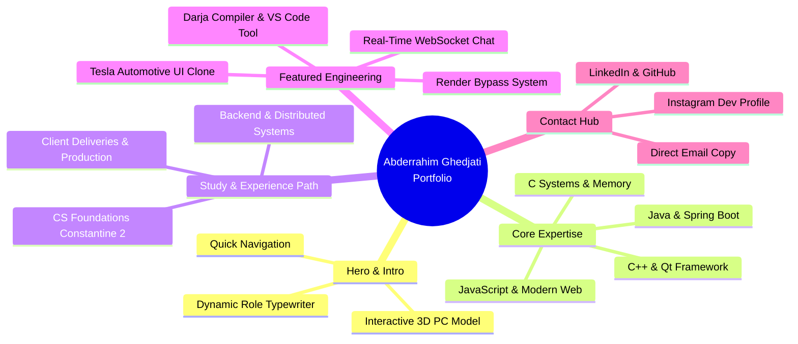

<div align="center">


<p align="center">
  <a href="#-about-the-portfolio">About</a> •
  <a href="#-features">Features</a> •
  <a href="#-tech-stack">Tech Stack</a> •
  <a href="#-featured-projects">Projects</a> •
  <a href="#%EF%B8%8F-getting-started">Getting Started</a> •
  <a href="#-connect-with-me">Connect</a>
</p>

[](https://github.com/rahmoni47/Portfolio-Website)
[](https://www.linkedin.com/in/abderrahim-ghedjati-435b74281/)
[](mailto:ghedjatirahmoni@gmail.com)
[](LICENSE)

<br/>

<p align="center">
  <b>Welcome to my interactive 3D developer portfolio!</b><br/>
  Designed and crafted to showcase my engineering journey, systems & backend specializations, and production projects.
</p>

</div>

---

## 🌟 About The Portfolio

I'm **Abderrahim Ghedjati** (also known as **Rahmoni**), a Computer Science and Software Engineering student at **Université Constantine 2 – Abdelhamid Mehri** (جامعة قسنطينة 2 – عبد الحميد مهري). 

I specialize in **Back-End Engineering**, **DevOps & Cloud Automation**, and **Systems Programming**, with deep hands-on expertise building scalable distributed services with **Spring Boot**, high-performance native UIs with **Qt (C++)**, and modern reactive front-ends.

This repository hosts the source code for my interactive portfolio, featuring real-time 3D models, fluid glassmorphic interfaces, particle starfields, and responsive design across all devices.

---

## ✨ Features

- **🪐 Interactive 3D Graphics**: Built with Three.js and `@react-three/fiber`, featuring interactive 3D workstation and planetary canvasses with dynamic camera controls.
- **🌌 Particle Starfield Background**: Dynamic 3D star-space background rendered continuously via React Three Fiber.
- **💎 Glassmorphic & Cyber-Futuristic UI**: Tailored Tailwind CSS theme with ambient back-glows, tilt physics via `react-tilt`, and subtle micro-animations.
- **📜 Vertical Study & Experience Path**: Milestone timeline powered by `react-vertical-timeline-component` detailing academic foundations, backend specialization, and real-world deliveries.
- **🚀 Project Showcase Grid**: Interactive cards displaying core projects with live tags, architectural summaries, and direct repository links.
- **📬 Connected Contact Hub**: Quick-copy direct email mechanism and verified links to GitHub, LinkedIn, and social profiles.



---

## 💻 Tech Stack

<div align="center">

### Frontend & 3D Experience
[](https://skillicons.dev)

### Backend & Core Specialization
[](https://skillicons.dev)

### Systems & Tools
[](https://skillicons.dev)

</div>

<br/>

| Category | Technologies & Tools |
| :--- | :--- |
| **Languages** | Java, C, C++, JavaScript (ES6+), SQL, HTML5, CSS3 |
| **Frameworks & Libraries** | Spring Boot, React.js, Qt Quick / QML, Tailwind CSS, Framer Motion, Three.js |
| **Databases & Caching** | PostgreSQL, MongoDB, Redis, Hibernate ORM |
| **DevOps & Cloud** | Docker, Jenkins, Grafana, Swagger / OpenAPI, Keycloak |
| **Protocols & Architecture** | REST APIs, WebSocket / STOMP, Microservices, Event-Driven Architecture |

---

## 🚀 Featured Projects

Here are some of the engineering projects highlighted in the portfolio:

| Project | Description | Tech Stack | Link |
| :--- | :--- | :--- | :--- |
| **Render Bypass System** | Lightweight automation service keeping Render free-tier apps alive 24/7 with periodic automated health pings. | `Spring Boot` `Java` `Cron Automation` `REST API` | [GitHub](https://github.com/rahmoni47/RenderBypassSystem) |
| **Real-Time WebSocket Chat** | Full-duplex bidirectional chat application built with Spring Boot and WebSocket/STOMP protocol. | `Spring Boot` `WebSocket` `STOMP` `Java` | [GitHub](https://github.com/rahmoni47/chatappWithWebsocket) |
| **Darja Compiler & Tooling** | Custom programming language engine with Algerian Darija/Arabic syntax (Lexer, Parser, AST, Interpreter) + VS Code extension. | `Compiler Design` `AST` `VS Code Ext` `Darija` | [GitHub](https://github.com/rahmoni47/darja-compiler) |
| **Tesla Automotive UI Clone** | High-performance digital instrument cluster & infotainment UI clone built with Qt Quick, QML, and C++. | `Qt Quick` `QML` `C++` `Automotive UI` | [GitHub](https://github.com/rahmoni47/TeslaUI) |

---

## 🛠️ Getting Started

Follow these steps to run the portfolio locally on your machine:

### Prerequisites

Ensure you have [Node.js](https://nodejs.org/) installed (version 16 or higher recommended).

### 1️⃣ Clone the repository

```bash
git clone https://github.com/rahmoni47/Portfolio-Website.git
```

### 2️⃣ Navigate into the project directory

```bash
cd Portfolio-Website
```

### 3️⃣ Install dependencies

```bash
npm install
```

### 4️⃣ Start the local development server

```bash
npm run dev
```

### 5️⃣ Open in browser

Open your browser and navigate to `http://localhost:5173` (or the port specified by Vite in your terminal).

---

## 📦 Build for Production

To generate an optimized production build:

```bash
npm run build
```

To preview the production build locally:

```bash
npm run preview
```

---

## 📬 Connect With Me

Feel free to reach out for collaborations, freelance projects, or tech discussions!

- 📧 **Email**: [ghedjatirahmoni@gmail.com](mailto:ghedjatirahmoni@gmail.com)
- 💼 **LinkedIn**: [Abderrahim Ghedjati](https://www.linkedin.com/in/abderrahim-ghedjati-435b74281/)
- 🐙 **GitHub**: [@rahmoni47](https://github.com/rahmoni47)
- 📸 **Instagram**: [@rahmoni.dev](https://www.instagram.com/rahmoni.dev/)

---

<div align="center">

Crafted with ❤️ by **Abderrahim Ghedjati (Rahmoni)**  
MIT License © 2026 Abderrahim Ghedjati


</div>
